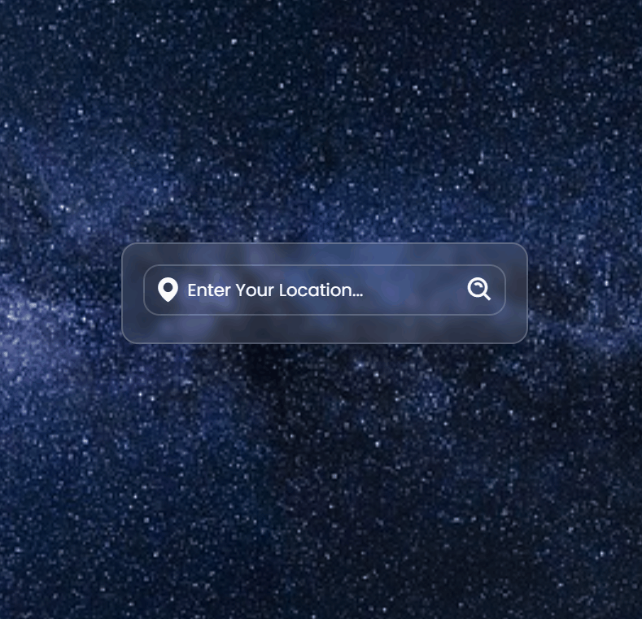

 

  

<h3 align="center"> Country Weather </h3>

  

    🚩 Learn the weather of the country you want 🚩
     
    <a href="https://country-weather-three.vercel.app/"><strong>LIVE »</strong></a>
     
  

## About The Project

 
 
If you want to know the instant weather forecast of the countries, just write the country name.  

(<a href="#responsive">Go Responsive Designs</a>)

(<a href="#readme-top">back to top</a>)

<!-- USAGE EXAMPLES -->
## Usage
* Enter the name of the country whose weather you want to know in the search field.  
* When you enter the country name, you can see the temperature, humidity and wind values.  

## Squares

  

## Responsive Designs 📲💻
<!-- Responsive Designs -->

     
     

